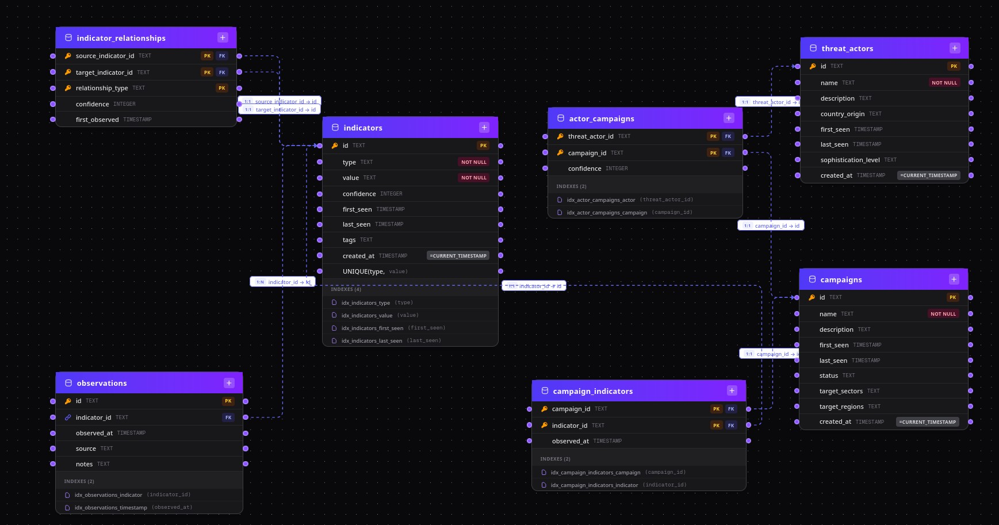

# Take-Home Assignment — Backend Position

## Threat Intelligence API

### How to Run

#### Easiest: Use the Live API

The API is deployed at: [https://takehome-backend-as-gabrielr.up.railway.app](https://takehome-backend-as-gabrielr.up.railway.app)

- **Interactive docs (Swagger):** [https://takehome-backend-as-gabrielr.up.railway.app/docs](https://takehome-backend-as-gabrielr.up.railway.app/docs)
- **Postman collection:** [challenge/threat-api-postman-collection.json](challenge/threat-api-postman-collection.json)

#### Run Locally

1. **Create a virtual environment and install dependencies**

   ```bash
   python -m venv .venv
   source .venv/bin/activate
   pip install -r requirements.txt
   ```

2. **Start the API server**

   ```bash
   uvicorn app.main:app --reload
   ```

3. **Run tests**

   ```bash
   pytest
   ```

#### Run with Docker

```bash
docker build -t threat-api .
docker run -p 8000:8000 threat-api
```

#### Local Endpoints

- **API base:** [http://localhost:8000/api/indicators](http://localhost:8000/api/indicators)
- **Swagger docs:** [http://localhost:8000/docs](http://localhost:8000/docs)

---

## Technology Choices

### Python over Node.js

I am comfortable with both Node.js and Python. I chose Python for this assignment because it would be easier to integrate with AI-related frameworks (e.g. PyTorch, LangGraph) if the product evolves in that direction.

### FastAPI

FastAPI was chosen for built-in request/response validation (Pydantic) and automatic OpenAPI documentation, which were both required. An alternative would have been Flask, but it would require extra setup to achieve the same.

### SQLAlchemy

An alternative would be SQLModel, which can unify Pydantic schemas and ORM models. I kept a clear separation between API schemas and database models, which tends to scale better in larger codebases and still allows custom response shapes for each endpoint.

---

## Assumptions and Query Design

### Note about DB queries optimization

To design these queries I used the SQLAlchemy documentation, feedback from AI tools, and assumptions about how to structure the operations for the best performance. In a production setting, I would convert these into raw SQL and then optimize them with profiling. For example, running `EXPLAIN ANALYZE` on the queries would show whether the database is using the indexes as intended. Some endpoints are called rarely (e.g. single-indicator details) while others are called often (e.g. dashboards); it's important to profile both cold starts and warm cache behaviour so that performance is understood under real conditions.

### Indicator Details Endpoint

The dependency between tables is illustrated in:

Created with [graphmydb.online](www.graphmydb.online)

Conceptually, the join path is:

**Indicator → Campaign Indicator → Campaign → Actor Campaigns → Threat Actor**

The relationship tables (`campaign_indicators`, `actor_campaigns`) are included explicitly because they carry useful fields (e.g. `actor_campaigns.confidence`) that are part of the indicator-details response.

A single-query version using joins would look like this:

```sql
SELECT
    i.*,
    ci.*,
    c.*,
    ac.*,
    ta.*
FROM indicators i
LEFT JOIN campaign_indicators ci ON ci.indicator_id = i.id
LEFT JOIN campaigns c ON c.id = ci.campaign_id
LEFT JOIN actor_campaigns ac ON ac.campaign_id = c.id
LEFT JOIN threat_actors ta ON ta.id = ac.threat_actor_id
WHERE i.id = :indicator_id_str;
```

A single query with multiple `LEFT JOIN`s can produce a large Cartesian product (one row per indicator–campaign–actor combination), which can be heavy on memory and risk OOM under load. For that reason, the implementation uses SQLAlchemy's **`selectinload`** instead of a single joined query. `selectinload` issues a fixed number of separate queries (one for each relationship level), each with small result sets and no row duplication. This avoids both the N+1 problem and the Cartesian explosion, trading a few extra round-trips for better memory efficiency.

With the results of that query it is possible to populate the indicators details, associated threat actors and campaigns. But it is still needed to deduplicate the threat actors. The deduplication of these is made in the campaign_actor_detail_mapper ind I made the assumption here that it is ok to keep the threat actor with the most confidence.

#### Indicator-to-indicator relationships (related indicators)

A second query loads **related indicators**: other indicators linked to this one via the `indicator_relationships` table (e.g. same campaign, same infrastructure, co-occurring). The current indicator can be either source or target, so we match on both columns. Everything is fetched in **one query** by joining the relationship table with `indicators` twice (source and target) and using `CASE` to select the "other" indicator's columns on each row:

```sql
SELECT
    ir.relationship_type,
    CASE WHEN ir.source_indicator_id = :indicator_id_str THEN ti.id      ELSE si.id END      AS other_id,
    CASE WHEN ir.source_indicator_id = :indicator_id_str THEN ti.type   ELSE si.type END   AS other_type,
    CASE WHEN ir.source_indicator_id = :indicator_id_str THEN ti.value  ELSE si.value END  AS other_value
FROM indicator_relationships ir
JOIN indicators si ON si.id = ir.source_indicator_id
JOIN indicators ti ON ti.id = ir.target_indicator_id
WHERE ir.source_indicator_id = :indicator_id_str
   OR ir.target_indicator_id = :indicator_id_str
ORDER BY ir.first_observed DESC
LIMIT 5;
```

This avoids three round-trips (one for relationships plus two for source/target indicators) while keeping the result set small (at most 5 rows). The mapper builds the response from these rows directly.

### Indicator Search

**Endpoint:** `GET /api/indicators` (query params: `type`, `value`, `first_seen_after`, `last_seen_before`, `campaign`, `threat_actor`, `page`, `limit`)

Search returns a paginated list of indicators with per-row **campaign count** and **threat actor count**. The implementation uses a single main query plus up to one extra count query when the page is empty (the client requested a page over the total number of pages).

1. **Filtered IDs subquery**  
   A subquery selects distinct indicator IDs matching all applied filters (type, value ILIKE, first_seen/last_seen range, campaign via `campaign_indicators`, threat_actor via `campaign_indicators` + `actor_campaigns`). This becomes the driving set for the rest of the query.

2. **Aggregated counts**  
   Two derived subqueries join this set with `campaign_indicators` (and for threat actors, also `actor_campaigns`):
   - **Campaign count:** `COUNT(DISTINCT campaign_id)` per indicator.
   - **Threat actor count:** `COUNT(DISTINCT threat_actor_id)` per indicator (through campaigns linked to the indicator).

3. **Main data query**  
   The API selects indicator fields plus the two counts via `OUTER JOIN` to the count subqueries, and uses a window function `COUNT(*) OVER ()` to get the total matching rows for pagination. Results are ordered by `first_seen DESC`, then `id`, with `OFFSET`/`LIMIT` for the requested page. If the page has at least one row, the total comes from the window; if the page is empty, a separate `COUNT` on the filtered-ID subquery is run once.

So in the typical case (non-empty page) the endpoint runs **one query**; with an empty page it runs **two queries**.

---

### Campaign Timeline

**Endpoint:** `GET /api/campaigns/{campaign_id}/indicators` (query params: `group_by` = day | week, `start_date`, `end_date`)

Returns a campaign’s indicators organized in time buckets (by day or week) for timeline visualization, plus a summary (total indicators, unique IPs/domains, duration). The implementation uses **four queries**:

1. **Campaign lookup**  
   `SELECT * FROM campaigns WHERE id = :campaign_id` to validate the campaign and load its metadata.

2. **Timeline rows**  
   From `campaign_indicators` JOIN `indicators`, filtered by `campaign_id` and optional `observed_at` range. The “period” is computed with `strftime('%Y-%m-%d', observed_at)` for day or `strftime('%Y-W%W', observed_at)` for week. Each row is (period, indicator id, type, value), ordered by period and `observed_at DESC`. The application groups these into buckets (one per period) and attaches counts.

3. **Counts per period and type**  
   Same base (campaign_indicators + indicators, same filters), grouped by (period, indicator type) with `COUNT(DISTINCT indicator_id)`. Used to fill each bucket’s `counts` (e.g. how many IPs vs domains per day/week).

4. **Summary**  
   One row: `COUNT(indicator_id)` as total_indicators, conditional counts for unique IPs and unique domains (`CASE WHEN type = 'ip' THEN id END` etc.), and `MIN(observed_at)` / `MAX(observed_at)` for duration. All over the same campaign + optional date range.

**Performance consideration:** Adding an index on observed_at could improve the performance of the filters. A composite index like (campaign_id, observed_at) should also be considered.

---

### Dashboard

**Endpoint:** `GET /api/dashboard/summary` (query param: `time_range` = 24h | 7d | 30d)

Returns high-level stats for a dashboard: new indicators by type, active campaign count, top 5 threat actors by indicator count in the window, and overall indicator distribution by type. The implementation uses **four queries**:

1. **New indicators by type**  
   `SELECT type, COUNT(id) FROM indicators WHERE first_seen >= :cutoff GROUP BY type`. The cutoff is now minus 24 hours, 7 days, or 30 days depending on `time_range`. Assumption: “New” is defined as first seen in that window.

2. **Active campaigns**  
   `SELECT COUNT(id) FROM campaigns WHERE status = 'active'`.

   Assumption: Here we need all the active campaigns, not just in the selected period. It is not clear in the requirements.

3. **Top 5 threat actors**  
   From `actor_campaigns` JOIN `threat_actors` JOIN `campaign_indicators`, restricted to `campaign_indicators.observed_at >= :cutoff` (same time window). Group by threat actor, `COUNT(DISTINCT indicator_id)`, order by that count DESC, LIMIT 5. So “top” means most distinct indicators linked via their campaigns in the selected period.

4. **Indicator distribution**  
   `SELECT type, COUNT(id) FROM indicators GROUP BY type` (all time). Used for the overall breakdown by type (ip, domain, url, hash).

   Assumption: Again, here I consider that we need overall statistics, not filtered by observed_at. If this is not the case, it can be fixed easily by filtering with cutoff.

Indexes on `indicators(first_seen)` and `campaign_indicators(observed_at)` help the time-bounded queries (new indicators, top threat actors).
